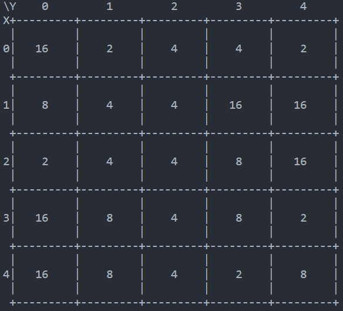
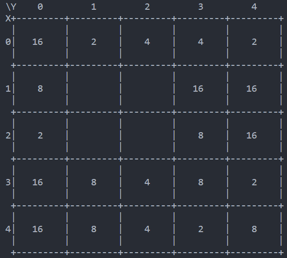
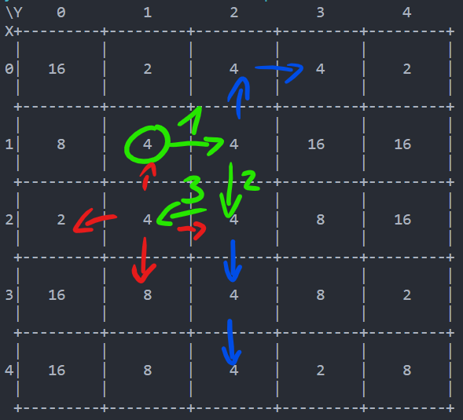

# Arbeiten am Numtrip

## Besprechung Benutzereingaben

Ich verglich mit Thomas den Code, und wir beide verwenden ein sehr ähnliches system, was die Besprechung kurz hielt.

## Arbeiten Numtrip
Als erstes habe ich den Auftrag gelesen, und ausgeführt.
Ich passte das Programm von Wikipedia auf mein Programm an. Der Code sah wie folgt aus:
```
def checkandremove(x, y, oldvalue, newvalue):
    if spielfeld[x][y] == oldvalue:
        spielfeld[x][y] = newvalue
        checkandremove(x,y+1,oldvalue,newvalue)
        checkandremove(x,y-1,oldvalue,newvalue)
        checkandremove(x+1,y,oldvalue,newvalue)
        checkandremove(x-1,y,oldvalue,newvalue)
        game()
```
Nach ein paar tests bemerkte ich, dass wenn z.b. `x` bereits `4` ist, und dann `x+1` überprüft wird, dies ausserhalb der liste ist. Deshalb änderte ich den code zu dem:
```
def checkandremove(x, y, oldvalue, newvalue):
    if spielfeld[x][y] == oldvalue:
        spielfeld[x][y] = newvalue
        if y+1 <= 4:
            checkandremove(x,y+1,oldvalue,newvalue)
        if y-1 >= 0:
            checkandremove(x,y-1,oldvalue,newvalue)
        if x+1 >= 0:
            checkandremove(x+1,y,oldvalue,newvalue)
        if x-1 <= 4:
            checkandremove(x-1,y,oldvalue,newvalue)
        game()
```
Nach weiteren Tests, fiel mir noch ein grösseres noch nicht gelöstes Problem auf.



Nehmen wir dieses Feld. Wenn nun der Player den input `X = 1, Y = 1` eingibt, kommt dieses Feld heraus:



Ich fragte mich warum. Nach dem Betrachten des Codes wusste ich es.
Auf dieser Darstellung zeige ich es.



Als erstes wird von `1, 1` aus nach rechts geprüft. Auf diesem Feld wird dann als nächstes nach unten geprüft, und danach nach rechts (wo kein passendes Feld ist), und danach nach links, wo die letzte 4 ist, die entfernt wird. Von diesem Feld aus wird nun in alle richtungen überprüft, jedoch keine 4 mehr entdeckt. Die auf dem Bild Blau markierten Pfeile sollten noch geprüft und entfernt werden, dies passiert jedoch nicht, aufgrund der reihenfolge im code.

Ich überlegte den rest der Zeit noch daran, fand jedoch keine Lösung für den Code. Jedoch kann man dieses Beispiel lösen, indem der Spieler die Position `X = 0, Y = 3` wählt.

### Lösung wird gesucht!!!
