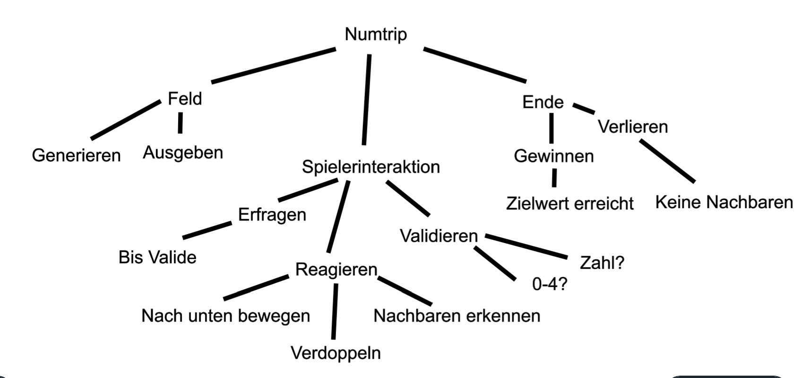

# Finaler Blogbeitrag NumTrip
Seit der Erstellung des NumTrip.py Games am 16. September 2022 arbeiteten wir immer wieder an diesem NumTrip Spiel. Doch was ist das überhaupt?
## Das Spiel
Ziel des Spieles *NumTrip* ist es, ein Feld mit dem Wert 128 (oder eine andere selbst festgelegte Zweierpotenz) zu erreichen. Zum Beginn hat man nur ein Feld mit zufälligen Zweierpotenzen. Indem man Koordinaten des Feldes aussucht, das Nachbarfelder mit dem gleichen Wert hat, kann man den Wert dieses Feldes verdoppeln, und die umliegenden Felder verschwinden lassen. Nun generieren oben am Feld neue Zahlen. So kann man versuchen, die Felder so lange zu kombinieren, bis man 128 erreicht hat. So **gewinnt** man das Spiel.

Jedoch kann man auch verlieren. Wenn es keine Felder mehr gibt, die man kombinieren kann, hat man **verloren**.

## Umsetzung
### Voraussetzungen
Um meine Version des NumTrip zu spielen, braucht man eine Applikation (z.b. VisualStudioCode) um ein Python Programm laufen zu lassen. Unsere verwendete Python Version ist *Python 3.10.6*. Meinen Code findet man auf [GitHub](https://github.com/No0ne155/ef_info/blob/main/NumTrip/NumTrip_FINAL.py) Diesen kann man in ein Dokument in VSCode kopieren, dass die Endung `.py` hat. Damit definiert man, dass es ein Python Dokument ist. 
### Top-Down Entwurf
Um ein grosses Projekt besser erfüllen zu können, verwendet man einen sogenannten Top-Down Entwurf. Mein Top-Down Entwurf hat auf der obersten Ebene das NumTrip-Game. Dies teilt man nun in immer kleinere Teilprobleme auf, bis man viele kleine Dinge hat, die einfacher sind. Diese fügt man dann zusammen, damit man ein komplettes Projekt hat.

z.b. im Bereich Feld, habe ich für das Generieren des Feldes die Funktion `generatefield()` erstellt. Diese Funktion generiert zufallszahlen, und fügt die in die `spielfeld` Liste. Für das Ausgeben des Feldes habe ich die Funktion `printfield()` erstellt. Diese Druckt das Design des Spielfeldes, und entsprechend der Grösse der Zahl, wird die Funktion so angepasst, dass das Design nicht durcheinander kommt. Diese beiden Funktionen zusammen ergeben das Spielfeld. Zum Schluss werden die Funktionen an der richtigen Stelle im Code oder in anderen Funktionen aufgerufen. So ähnlich funktioniert es auch mit allen anderen Teilbereichen die im Top-Down Entwurf geschrieben sind.
### Konzept Nachbarprüfung
Im Spiel verwende ich viele sogenannte Algorithmen. Einer davon wird z.b. für die Überprüfung ob eine Nachbarzelle vorhanden ist eingesetzt. Die Funktion wird benötigt, denn wir wollen die Zahl ja nur verdoppeln, wenn sie auch mindestens ein Feld rundherum hat, dass den gleichen Wert hat. Dafür erstellen wir die folgende Funktion: `validateneighbour(y, x)` Dabei sind `y` und `x` Parameter die man beim Aufrufen der Funktion mitgibt. In diesem Fall entsprechen die Parameter den Koordinaten im Spielfeld. Die Parameter sind in der gewählten Reihenfolge, da `y` für die Zeile steht, und `x` für die Spalte.

Beim Aufrufen der Funktion wird überprüft, ob die Funktion `True` zurückgibt. Nun muss die Funktion `True` zurückgeben, wenn ein Nachbar vorhanden ist, sonst muss `False` zurückgegeben werden. Im ersten Schritt prüfen wir ob in die `x-1` Richtung ein Nachbar ist. Damit kein List-Index ERROR erscheint, prüfen wir, ob die Zahl grösser als `1` ist, da wir `1` subtrahieren, und nicht ins Negative wollen. Diese Überprüfung findet mit 
``` py 
if x >= 1:
```
statt. Wenn dieses Statement zutrifft, geht es weiter zur Überprüfung, ob die ausgewählten Koordinaten den gleichen Wert gespeichert haben, wie die selbe Koordinate aber mit `x-1`. 
```py
if spielfeld[x-1][y] == spielfeld[x][y]:
            return True   
```
Dies wird nun in alle anderen Richtungen genau gleich angewendet. Natürlich mit anderen werten.
Wenn nie ein Feld den gleichen Wert hat, wird zum Schluss `False` zurückgegeben. Gesamt sieht der Algorithmus dann so aus:
```py
def validateneighbour(y,x):
    if x >= 1: 
        if spielfeld[x-1][y] == spielfeld[x][y]: 
            return True                          
    if x <= 3:
        if spielfeld[x+1][y] == spielfeld[x][y]:
            return True
    if y >= 1:
        if spielfeld[x][y-1] == spielfeld[x][y]:
            return True
    if y <= 3:
        if spielfeld[x][y+1] == spielfeld[x][y]:
            return True
    return False
```
## Probleme
Mein grösstes Problem war, dass ich gewisse Funktionen so aufbaute, dass sie Funktionierten, aber nicht mit künftigen Funktionen kompatibel waren. So kam ich oft an den Punkt, dass ich vieles überarbeiten musste, da ich früher nicht gut genug arbeitete.

Es kam sogar so weit, dass ich Fehler hatte, nicht wusste woher, die Logik keinen Sinn mehr ergab, so dass ich mich entschied, von vorne anzufangen. Ich verwendete natürlich gewisse Funktionen wieder, aber ich fing wieder von 0 an, damit ich alles nochmals Schritt für Schritt durchgehen kann. Z.b. fügte ich in der `printfield()` Funktion die neuen, angepassten Strings (der Zahlenwert mit passender Anzahl Leerzeichen) HINTEN an die Liste, löschte sie jedoch nie, weshalb sich mein Spielfeld nicht Veränderte, egal was ich als Input gab. Solche kleinen Fehler wären mir sonst nicht aufgefallen.

## Tipps:
Wenn du auch so ein Programm schreibst, überleg dir manchmal zuerst, was du später auch noch in die Funktion einfügen musst, damit du sie später nicht nochmals schreiben musst. 

Ebenfalls ist es hilfreich, wenn du deinen Funktionen und Variablen Namen gibst, die dir klar machen, was sie tun, sodass du den Überblick behaltest. Aber mach die Namen auch nicht zu lange, denn es kann sehr mühsam sein, den Namen `spielfeldnice[playerinputY][playerinputX]` in einer Funktion 4 mal zu schreiben.

## Fazit
Mit mehr Zeit, wären noch viele Features mehr möglich gewesen. Da man aber nicht immer viel Zeit hat, sich die Zeit nicht nimmt, oder ein Problem hat, dass sich einfach nicht lösen will, bin ich ganz zufrieden mit meinem Resultat. Am Anfang stockte es, doch als ich im Neugeschriebenen Programm (fast) alle Probleme gefunden hatte, ging alles sehr schnell. Weitere Features zu implementieren wären nicht die Komplizierteste Sache, jedoch muss man es machen, und nicht nur darüber Nachdenken

Allem in allem war es ein Großartiges Projekt.
