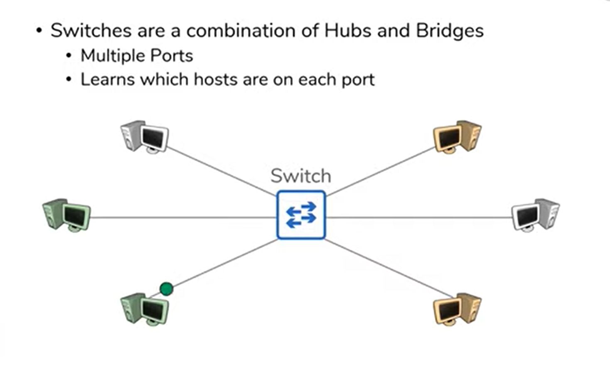
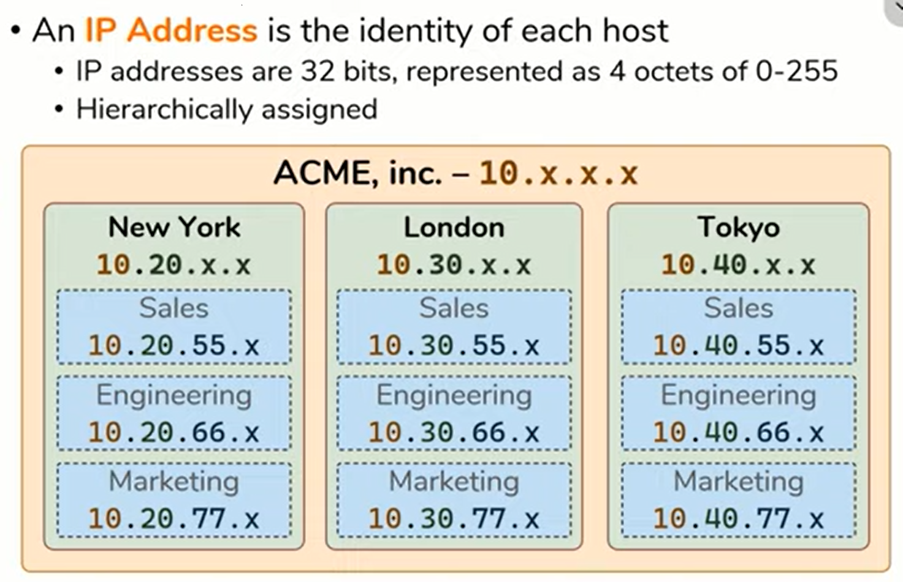
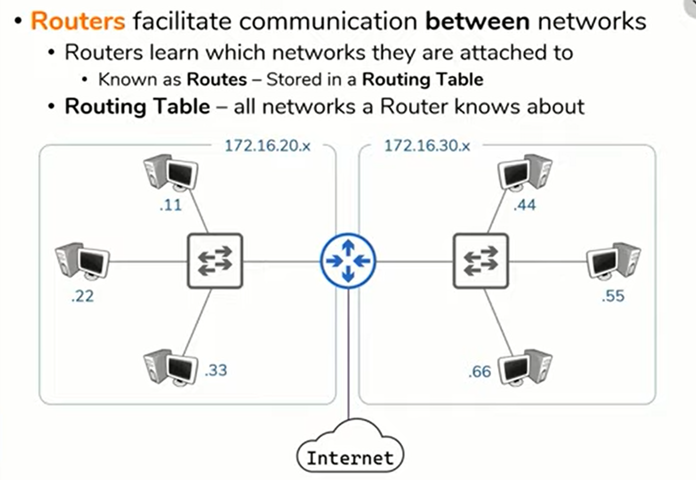
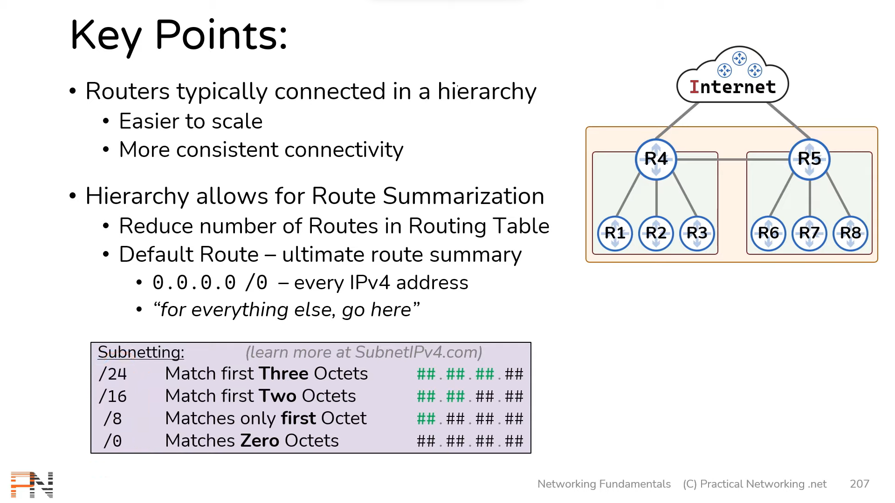
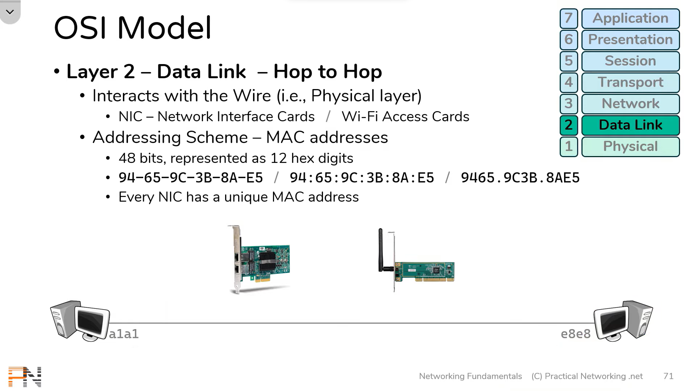
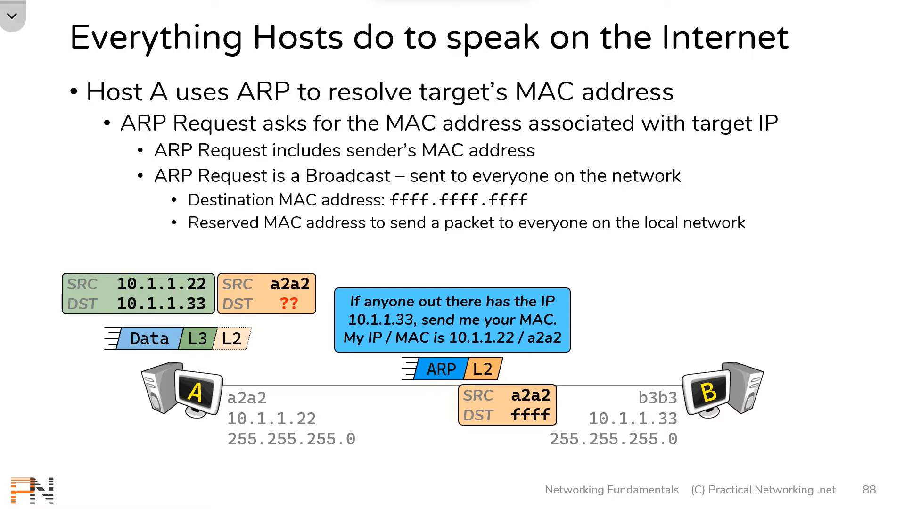
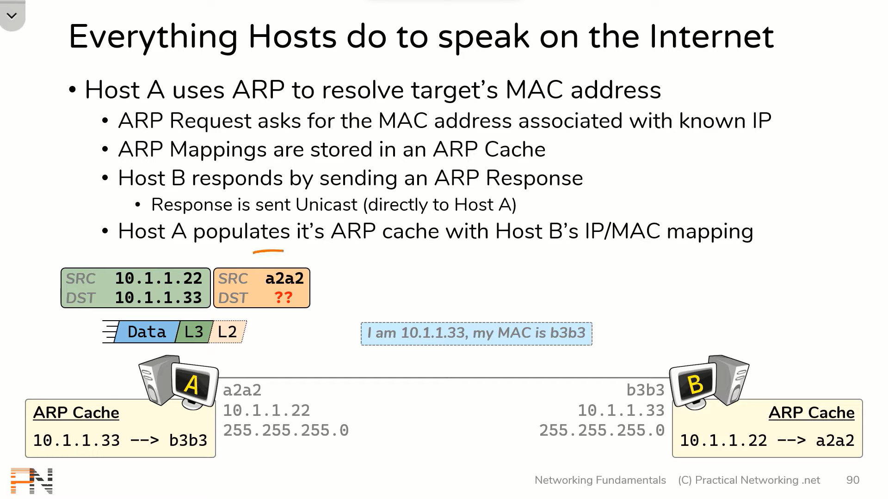
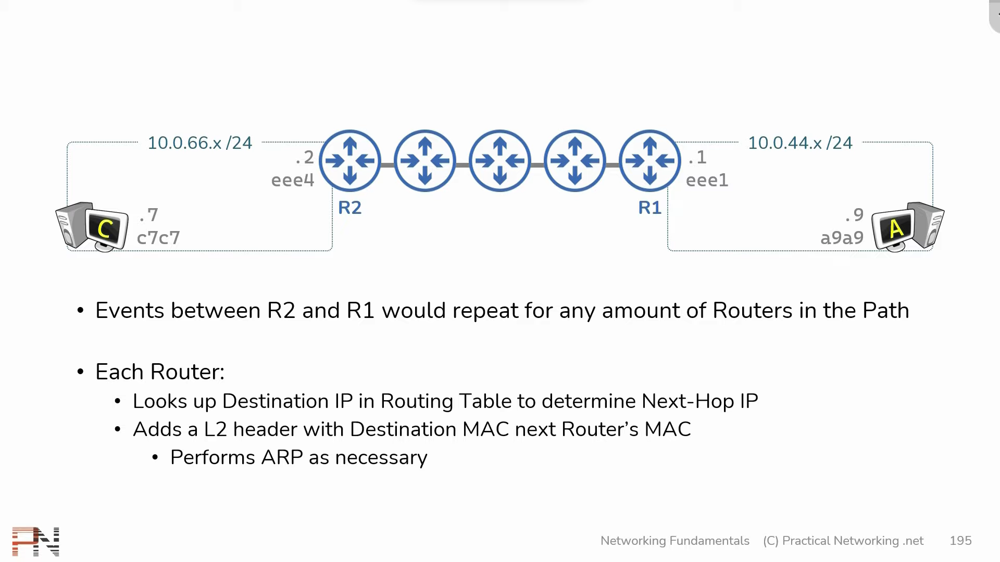
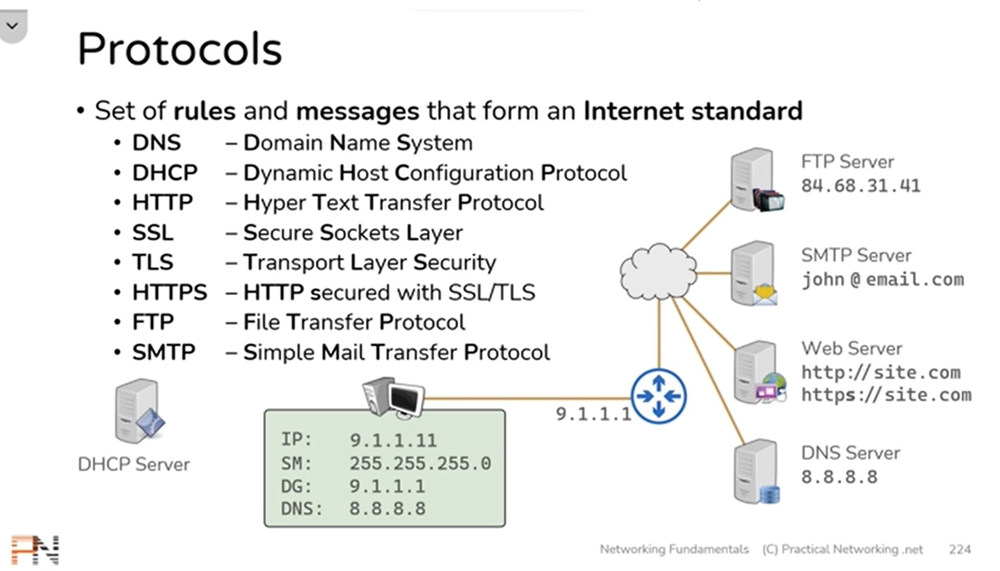
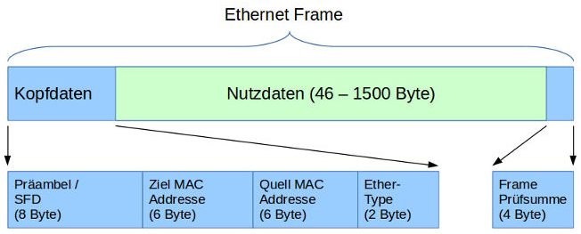

# Netzwerke

Zusammenfassung zu den Punkten der Kapitel 3 - 8

## Switch

Ein Switch ist ein Gerät, welches im lokalen Netzwerk weiss, welcher Host wo ist, und ein Paket nur an den Richtigen Host weiterleitet, und nicht an alle eine Kopie sendet. 
- Switches werden im Lokalen Netzwerk verwendet
- In der MAC-Tabelle des Switches, wird gespeichert welche IP / MAC adresse zu welchem Port gehört, um korrekt zu Kommunizieren
- Arbeitet nach 3 Schritten: 
    - `learn`: MAC-Tabelle updaten
    - `flood`: An alle Ports kopie sendn (Ausser Host), wird nur verwendet, wenn Adresse nicht in Tabelle ist.
    - `forward`: Mit MAC-Adressen-Tabelle das Paket an den Richtigen Client seden
- Der unterschied zwischen `flood` und `forward` ist, dass beim `flood` die MAC-Adresse `ffff.ffff.ffff` ist. Bei `forward` ist es die Spezifische MAC-Adresse.

Wie im Bild gezeigt, sendet der Switch ein Paket nur von Grün zu grün.

## IP-Adresse

Die IP-Adresse ist die Individuelle Adresse jedes Hostes in einem Netzwerk (Auch das Internet ist ein Netzwerk). Sie ist schichtartig aufgebaut, dass alle im gleichen Netzwerk eine ähnliche IP haben.

Dieses Netzwerk hat z.b. generell die IP `10.x.x.x`. Der Standort New York hat nun den zusatz `10.20.x.x` und das Marketing Team den zusatz `10.20.77.x` wobei x immer den individuellen Host beschreibt. Die anderen standorte unterscheiden sich nun nur im 2. Octett der Binären IP.

## Router

Der Router ist ein Gerät, welches Netzwerke untereinander verbindet. Das Internet ist dann im Grossen und Ganzen eine Verbindung von sehr vielen Routern die dich weiterleiten bis du am richtigen Ort bist.

Wie im Bild dargestellt verbinden sich die Switches eines Netzwerk mit dem Router, der die Netzwerke untereinander verbindet, jedoch auch mit dem Internet verbindet.

Router sind meistens in Hirarchien angeordnet um den Netzwerkverker zu vereinfachen. (siehe darstellung)

### Router Tabelle

Die Router Tabelle besteht aus allen Netzwerken die eine Router kennt, und mit jeder anfrage zu einem Neuen Server wird diese Tabelle grösser. So lernt der Router immer mehr, und "Lernt".
Man kann es sich wie als "Karte" aller bereits verwendeten Netzwerkverbindungen sehen.

Es gibt 3 Arten wie die Routing Tabelle verwendet wird:
- `Direkt Verbunden`: Router zwischen Netzwerken die Direkt miteinander verbunden sind
- `Statische Routen`: Routen die vom Administrator Manuell vorgegeben werden
- `Dynamische Routen`: Routen die von anderen Routern gelernt werden

## MAC-Adresse

Die MAC - Adresse (Media-Access-Control-Adress) ist die Individuelle Adresse eines NIC (Network Interface Card). NIC ermöglicht Kommunikation mit der Physischen schicht, weshalb dort die Individuelle Adresse ist. Denn die IP bezieht sich auf das Netzwerk, und kann sich je nach Netzwerk ändern.

MAC-Adressen bestehen aus 48 Bits, die als 12 Hexadezimale zeichen angegeben werden. Die MAC-Adresse ist die Individuelle, unverwechselbare Adresse eines Gerätes mit Internetzugang.

### MAC-Tabelle

Die MAC-Tabelle beinhaltet alle MAC-Adressen die ein Gerät mit NIC kennt. Dies beinhaltet auch die MAC-Adressen von Routern und Switches.

## ARP

ARP (Adress-Resolution-Protocol) wird verwendet, um die IP-Adresse mit der MAC-Adresse zu verknüpfen.

### ARP ohne Router
ARP-Request wird verwendet, wenn der Host die Ziel-IP-Adresse kennt, aber die MAC-Adresse der IP nicht kennt.

Der Host sendet nun einen ARP-Request an die IP des Servers, mit der MAC-Adresse ffff.ffff.ffff, da diese für diesen fall reserviert ist. Im ARP-Request ist die MAC-Adresse und IP des Hostes enthalten, damit der Ziel-Server problemlos antworten kann. 

Der Ziel-Server antwortet nun mit seiner IP und MAC-Adresse, und fügt die IP und MAC-Adresse seinem ARP-Cache zu.

Sobald diese Nachricht beim Host ankam, kann er seinen Layer-2 Header mit der MAC-Adresse ergänzen, und seine Nachricht schicken. Von nun an, ist die IP mit der MAC-Adresse bei beiden im ARP-Cache gespeichert, und dieser Schritt kann übersprungen werden.

### ARP mit Router

- Der Host sendet wieder einen ARP-Request raus
- Der erste Router empfängt den Request und fügt die angegebene Host-Angaben seiner Tabelle hinzu
- Router 1 sendet seine Angaben an den Host zurück
- Host sendet Paket an Router 1
- Router 1 empfängt packet, und entfernt seine eigenen Informationen
- Router 1 sucht nach der Ziel MAC, die er nicht hat,  und sendet deshalb einen ARP Request an den zweiten Router
- Router 2 sendet seine Angaben an Router 1 zurück
- Router 1 sendet Paket an Router 2
- Router 2 empfängt und entpackt das Paket
- Router 2 sucht nach Ziel MAC in seiner Tabelle
- Router 2 sendet ARP Request an Zielcomputer
- Zielcomputer sendet seine Angaben
- Router 2 sendet Paket an Zielcomputer, welches nun das Paket hat
- Die Antwort kann ohne schwierikeit das Netzwerk durchqueren, da alle weiteren MAC-Adressen in Tabellen eingetragen wurden
- Jeder Weitere Netzverkehr zwischen den beiden ist nun sehr einfach.

## Weitere Infos:

Protokolle:

Anwendungsbeispiel:
[Youtube Video Zusammenfassung](https://www.youtube.com/watch?v=YJGGYKAV4pA)

## Gateway

Das Standart-Gateway ist die Verbindung die normalerweise als Erstes verwendet wird. Meistens ist dies der Router.

## Ethernet-Frame

Nachrichten in einem LAN werden in Form von Frames ausgetauscht. Ist dieses Kabelgebunden wird auch von Ethernet-Frames gesprochen. Ein Ethernet-Frame ist wie folgt aufgebaut:

