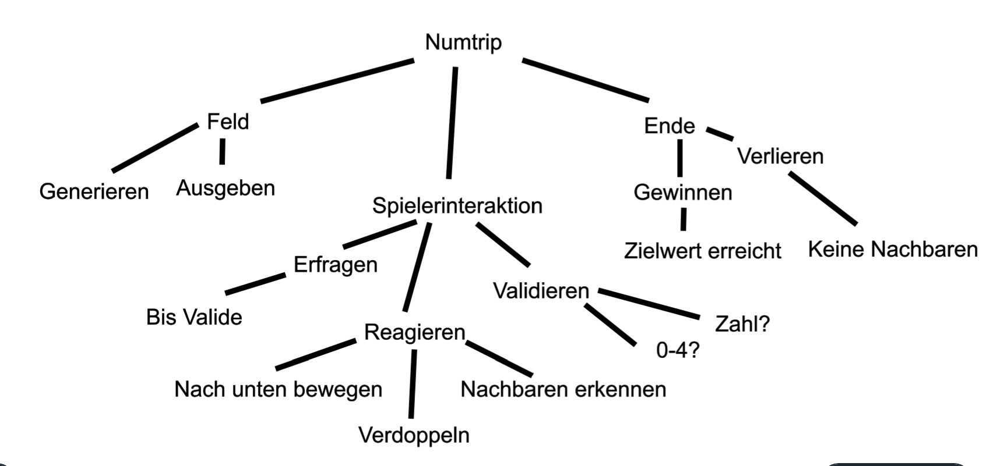

# NumTrip Top Down Entwurf

## Top-Down Entwurf:

Der Top-Down Entwurf hat auf der Obersten Ebene das NumTrip-Game. Dies teilt man nun in immer kleinere Teilprobleme auf, bis man viele kleine dinge hat, die einfacher sind. Diese fügt man dann zusammen, damit man ein komplettes Projekt hat. Für das NumTrip spiel konnte ich es so unterteilen: 
+ ## Feld
    + ### Generieren
        + Random Zahlen verwenden
    + ### Ausgeben
        + Feld in schönem Layout mit Zahlen aus Liste ausgeben
+ ## Ende
    + ### Gewinnen
        + Ein Feld hat den im code gesetzten endwert erreicht
        + Spiel beenden, Gewinnnachricht anzeigen, Feld nochmals anzeigen
    + ### Verlieren
        + Keine möglichkeit mehr ein Feld zu wählen
        + Endnachricht anzeigen, Feld nochmals Anzeigen, Spiel beenden
+ ## Spielerinteraktion
    + ### Erfragen
        + Solange bis der Input als Valide bestätigt wurde
    + ### Validieren
        + Ist der Input eine Zahl?
        + Ist der Input im Spielfeld?
    + ### Reagieren
        + Die umliegenden Felder mit der gleichen Zahl entfernen
        + Das ausgewählte Feld Verdoppeln
        + Die Felder oberhalb der Nachbarfelder nach unten bewegen