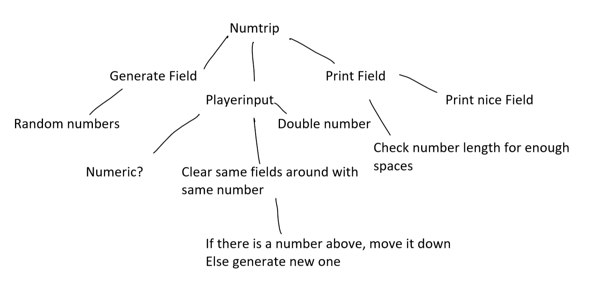

# NumTrip Top Down Entwurf

Top-Down Entwurf:

Der Top-Down Entwurf hat auf der Obersten Ebene das NumTrip-Game. Dies kann man zuerst aufteilen auf:
+ Feld Generieren
    + Aus Random Zahlen
+ Feld Anzeigen
    + Schöne Darstellung (Raster Rundherum)
    + Überprüfung der Zahlenlänge, für schöne darstellung
+ Input des Spielers
    + Verdopple das Ausgewählte Feld, wenn mindestens ein anderes Umliegendes Feld ebenfalls diese Zahl enthält
    + Überprüft ob andere Felder rundherum die gleiche Zahl haben
        + Zahlen die weiter oben sind, werden nach unten bewegt
        + Falls keine Zahlen weiter oben sind, Generiere neue Zahlen in den Feldern
    + Überprüfen ob die Eingabe eine Zahl zwischen 0 und 5 ist
